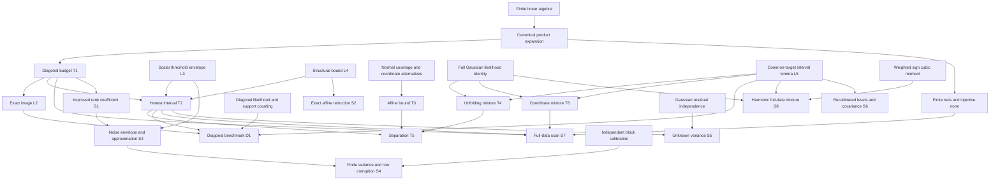

# Dependency graph

```mermaid
flowchart TD
  LA[Finite linear algebra] --> L1[Canonical product expansion]
  L1 --> T1[Diagonal budget T1]
  T1 --> L2[Exact image L2]
  L3[Scalar threshold envelope L3] --> T2[Honest interval T2]
  L4[Structural bound L4] --> T2
  T1 --> T2
  Normal[Normal coverage and coordinate alternatives] --> T3[Affine bound T3]
  LR[Full Gaussian likelihood identity] --> T4[Unfolding mixture T4]
  LR --> T6[Coordinate mixture T6]
  L5[Common-target interval lemma L5] --> T4
  L5 --> T6
  T2 --> T5[Separation T5]
  T3 --> T5
  T4 --> T5
  L2 --> D1[Diagonal benchmark D1]
  Hyper[Diagonal likelihood and support counting] --> D1
  L5 --> D1
  T2 --> D1
  L1 --> Nets[Finite nets and injective norm]
  T1 --> S7[Full-data scan S7]
  Nets --> S7
  T2 --> S7
  T6 --> S7
  Cubic[Weighted sign cubic moment] --> S8[Harmonic full-data mixture S8]
  LR --> S8
  L5 --> S8
  T1 --> S1[Improved rank coefficient S1]
  L4 --> S2[Exact affine reduction S2]
  L3 --> S3[Noise envelope and approximation S3]
  S1 --> S3
  MOM[Independent block calibration] --> S4[Finite variance and row corruption S4]
  S3 --> S4
  Residual[Gaussian residual independence] --> S5[Unknown variance S5]
  T2 --> S5
  L5 --> S6[Recalibrated levels and covariance S6]
```

See dependency_audit.md for assumptions and proof locations. Q1–Q4 have no outgoing edges into proved statements.
